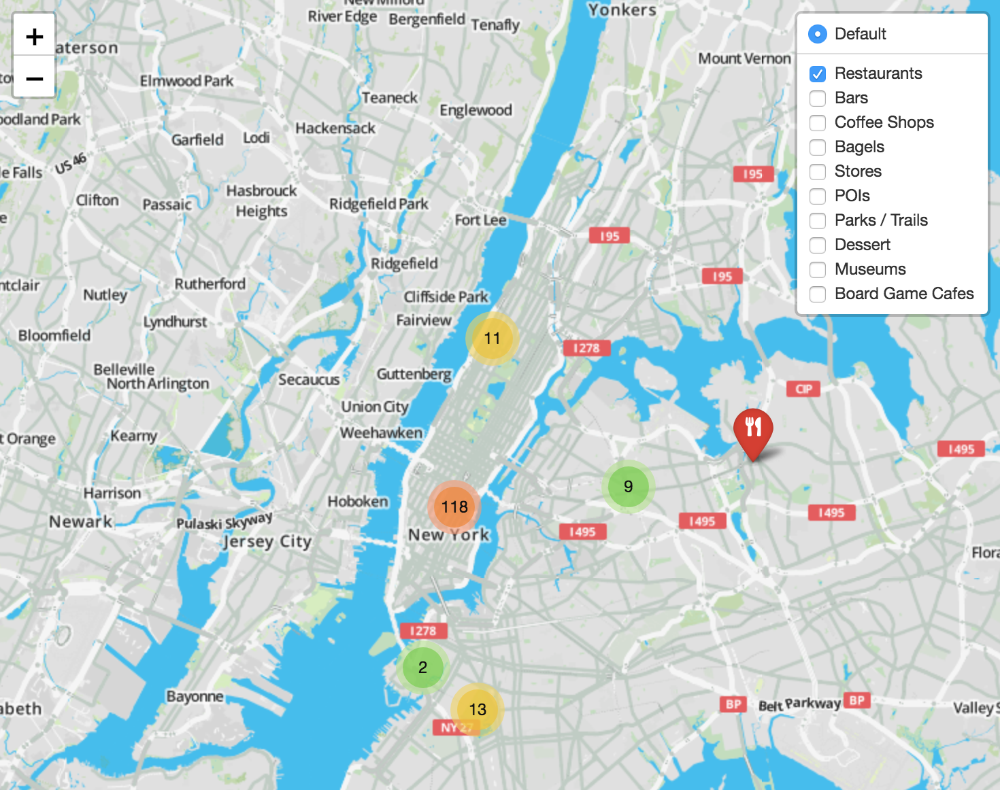

## Maps and Legends



This site is an example of using jekyll to drive map visualizations; I created it to get my personal map data out of google's clutches and into text files I can access with UNIX tools the way god intended.

## Features
* Use Jekyll collections for each location
* Use leaflet for map integration
* Easily import data from mymaps.google.com
* Use leaflet awesome-markers for colorful icons
* Use marker-clusters / featuregroup.subgroup for automatic and sensible clustering

## How to use
* Create `_locations/thinkcoffee1.md` with the following contents:
```
---
title: "Think Coffee"
description: >-
    Think Coffee is a great coffee shop!
latlng:
  - 40.728338,-73.995286
zoom: 12
layer: coffee
---
```
* Add more locations!

You can also use my import script in `bin/` to help bulk import a kmz file from mymaps.

### Cache server
#### A note about pickle

## TODO
See `TODO`

## Credits
* Ian Thompson for being a man, a myth, a legend.
* [Starting point for Leaflet and Jekyll](https://robyremzy.github.io/blog/2016/leaflet-inside-a-post/)
* [Leaflet.awesome-markers](https://github.com/lvoogdt/Leaflet.awesome-markers)
* [Leaflet.marker-clusters](https://github.com/Leaflet/Leaflet.markercluster)
* [Leaflet.FeatureGroup.SubGroup](https://github.com/ghybs/Leaflet.FeatureGroup.SubGroup)
* [Leaflet + JQuery UI](https://github.com/gregallensworth/L.Control.BootstrapModal)
